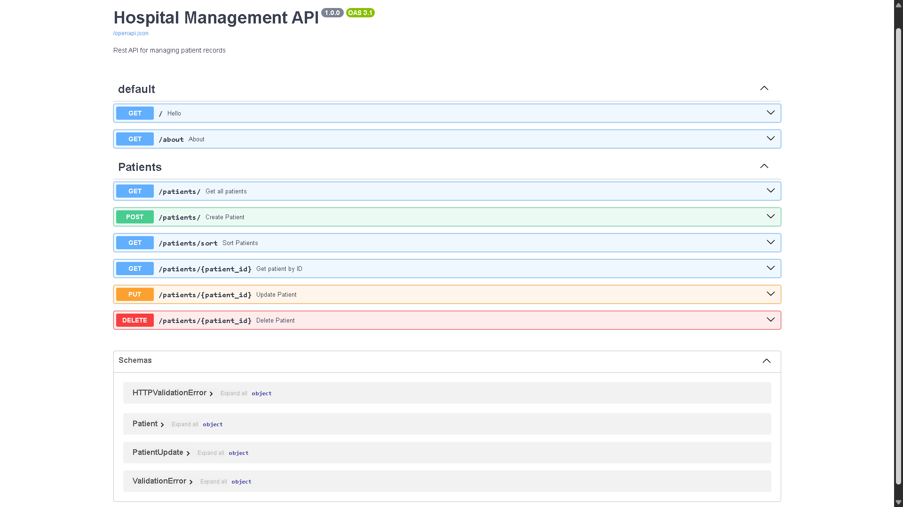

# 🏥 Hospital Management API

A simple REST API built with **FastAPI** to manage patient records using CRUD operations.

## 🚀 Features

- View all patients
- View a patient by ID
- Create a new patient
- Update patient details
- Delete a patient
- Sort patients by Height, Weight, or BMI
- Automatic request validation using Pydantic

## 🛠️ Tech Stack

- Python 3.10+
- FastAPI
- Pydantic
- Uvicorn
- JSON

## 📂 Project Structure

```text
hospital-management-api/
│
├── app/
│   ├── main.py
│   ├── config.py
│   ├── models/
│   ├── routers/
│   └── services/
│
├── data/
│   └── patients.json
│
├── .dockerignore
├── .gitignore
├── Dockerfile
├── compose.yaml
├── requirements.txt
└── README.md
```

## 📖 API Documentation

FastAPI automatically provides interactive API documentation.

### Swagger UI

http://localhost:8000/docs




## ⚙️ Installation

### 1. Clone the repository

```bash
git clone https://github.com/Prins-Satapara/hospital-management-api.git
```

### 2. Move to the project directory

```bash
cd hospital-management-api
```

### 3. Create and activate a virtual environment (recommended)

```bash
python -m venv venv
source venv/bin/activate      # On Windows: venv\Scripts\activate
```

### 4. Install dependencies

```bash
pip install -r requirements.txt
```

### 5. Run the server

```bash
uvicorn app.main:app --reload
```

The API will be available at:

http://localhost:8000

## 🔧 Configuration

Settings such as the server port and the data file path are managed in `app/config.py`. Update this file (or set the corresponding environment variables, if supported) to change the default configuration before running the app.

## 🐳 Run with Docker

### Pull the Docker Image

```bash
docker pull sataparaprins111/hospital-management-api:latest
```

### Run the Container

```bash
docker run -d -p 8000:8000 --name hospital-api sataparaprins111/hospital-management-api:latest
```

The API will be available at:

http://localhost:8000

### Swagger UI

http://localhost:8000/docs

### Stop the Container

```bash
docker stop hospital-api
```

### Remove the Container

```bash
docker rm hospital-api
```

## 🐳 Run with Docker Compose

Build and start the application:

```bash
docker compose up --build
```

The API will be available at:

http://localhost:8000/docs

To stop the application:

```bash
docker compose down
```

## 🔌 API Endpoints

| Method | Endpoint | Description |
|--------|----------|-------------|
| GET | `/patients` | Get all patients |
| GET | `/patients/{patient_id}` | Get a patient by ID |
| GET | `/patients/sort?sort_by={height\|weight\|bmi}&order={asc\|desc}` | Get patients sorted by height, weight, or BMI |
| POST | `/create` | Create a new patient |
| PUT | `/edit/{patient_id}` | Update patient details |
| DELETE | `/delete/{patient_id}` | Delete a patient |
